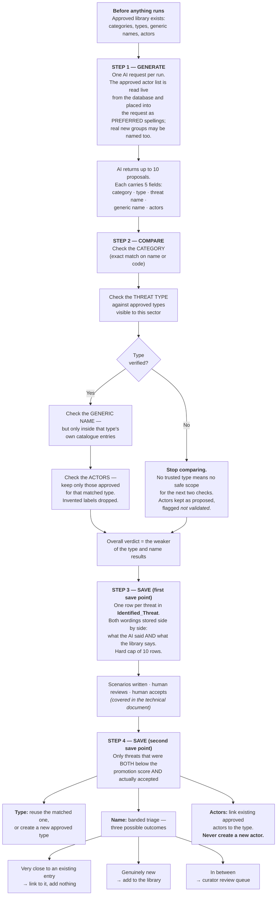

# TSG — How Threat Types, Threat Actors and Threats Are Generated, Compared and Saved

> **Audience:** business, risk, audit and product readers. No code knowledge assumed.
>
> **Scope:** the three library entities only — **threat type**, **threat actor**, **threat**. It
> covers where each one comes from, what it is checked against, and where it is written. Scenario
> writing, control mapping and the risk treatment plan are deliberately out of scope.
>
> **For the technical version** with source references, see
> [HOW_THREATS_ARE_GENERATED.md](HOW_THREATS_ARE_GENERATED.md).
>
> **For the functional team walkthrough** of the whole scenario lifecycle — starting a run, review,
> and your four decisions — see
> [THREAT_SCENARIO_FLOW_FUNCTIONAL.md](THREAT_SCENARIO_FLOW_FUNCTIONAL.md).

---

## 1. The three things this document is about

| Term | Plain meaning | Example |
|---|---|---|
| **Threat type** | The *generic* business impact, in library wording. Never mentions a product, technology or asset. | "Unauthorized disclosure" |
| **Threat** (threat name) | That same impact *as it applies to this specific asset*. Always names the asset. | "Unauthorized disclosure of Citizen Personal Information" |
| **Threat actor** | Who would realistically cause it. Only labels the organisation has already approved. | "Nation-state/APT", "Malicious insider" |

Two supporting terms you will meet below:

| Term | Plain meaning |
|---|---|
| **Threat library** | The organisation's approved catalogue: categories, types, generic threat names, and actors. It is the authority. |
| **Compared / grounded** | Checking an AI proposal against that library, so the same real-world threat worded two different ways always lands on the same catalogue entry. |

---

## 2. The one rule that explains everything else

> **The AI proposes. The library decides.**

The AI is never asked what is in the library, and it is never trusted about it. It proposes freely
from the facts of the asset. Every proposal is then checked, independently, against the approved
tables. Three separate checks run — one for the type, one for the threat name, one for the actors —
and **the weakest result sets the overall verdict**.

There are only ever two verdicts:

| Verdict | Business meaning |
|---|---|
| **Verified** | This matched an approved library entry. The library's official wording is used from here on. |
| **Unverified** | This is not in the library **yet**. It is *not* rejected — it still gets a full scenario, is still reviewed by a human, and is the raw material the library grows from. |

A second rule follows from the first, and it is why the AI is asked for the same impact twice, in two
different shapes:

- The **threat name** *must* contain the asset's name — because a reviewer needs to see what is at risk.
- The **generic name** *must not* — because that is the only wording ever compared against the
  library, or ever written into it.

Every approved catalogue entry is generic. Writing an asset-named entry into a shared library would
only ever park a near-duplicate beside the generic entry it belongs under.

---

## 3. The workflow at a glance

---

## 4. Step 1 — How they are generated

**One AI request, per run, for one asset.** Not one per threat.

**What the request contains.** Only facts drawn from the platform's own records — the asset, and the
supporting systems it depends on. Two protections apply before anything leaves the building:

1. **A fixed field set.** The platform decides in code which asset and supporting-system facts are
   assembled at all; nothing outside that set exists to be sent. There is no per-field on/off
   switch — changing what the AI can see is a code change, and that is the point at which the
   exposure is reviewed.
2. **Redaction.** Every free-text value is scrubbed for secrets and personal data first.
3. **No-value and identifier removal.** Blank values and placeholder labels ("NA") are dropped so
   the AI is never told something is *absent* when it is merely unrecorded, and internal database
   identifiers are stripped out entirely.

The asset's data is also clearly labelled as *information to describe, not instructions to follow*,
so an asset description that happens to read like a command is not obeyed.

**How the AI is told to think.** It is instructed to reason in one direction only:

> supporting system → attack path → protected asset → **business impact**

Supporting systems may be attacked or fail, but they are **attack paths, never the subject**. Only
the resulting business impact on the asset is returned. Two proposals that reach the same business
consequence by different routes are treated as the **same threat** — the AI is told to optimise for
discovering new kinds of impact, never for volume.

**What comes back.** Up to **10** proposals. Each carries five fields:

| Field | Rule it must obey |
|---|---|
| **category** | Exactly one of the six approved categories, read live from the database. |
| **type** | The generic impact. No asset, product or technology names. |
| **name** | `<impact> of <asset name>` — must name the asset. No attack techniques or tools. |
| **generic name** | The same impact with asset, product and technology names removed. |
| **actors** | Real, publicly documented groups or short generic roles. The approved actor list is included as **preferred spellings**; a name outside it is allowed only for a real group, never an invented one. Empty is a valid answer. |

**Where the actor list comes from.** It is read from the approved actor table at the moment the
request is built, and inserted as the preferred vocabulary — *"PREFER these existing labels,
spelled EXACTLY as given…"*. The AI may still name a real new group; that name then travels the
same recognize-and-gate road a novel threat type does (checks 4 and section 7). If the table has
never been populated, the request degrades honestly to asking for short generic role labels.

**Two business guarantees at this step:**

- **Repeatable.** Creativity is set to zero, so the same asset with the same facts yields the same
  threat list. Threat identification is not a lottery.
- **Fully auditable.** Every AI request and reply is recorded word-for-word, including when the
  reply is unusable. A malformed reply fails loudly and visibly; it is never quietly treated as
  "no threats found".

---

## 5. Step 2 — How they are compared

Three checks, in a strict order. **The order matters** — each check depends on the one before it
having succeeded.

### Check 1 — The category

An exact match (ignoring capitalisation) on the approved category's name or code. Failing to match
is **not** an error; it simply means the next check searches every category instead of a narrowed
set.

### Check 2 — The threat type

1. **Draw up candidates.** Approved types that are active, not deleted, and **visible to this
   asset's sector** — either global entries, or entries belonging to its own or parent sector. A
   type qualifies if *either* its own category matches *or* one of its catalogue entries is mapped
   to that category, because most curated threats carry more than one category.
2. **Shortlist.** Meaning-based similarity against the library, keeping everything above **0.60**,
   capped at the best **10**. If nothing clears the floor, the top 10 are kept anyway — so a poor
   match is scored honestly rather than silently disappearing.
3. **Score properly.** A second, more careful model scores that shortlist from 0 to 100. Best wins.
4. **Band it.** At or above the cutoff = **verified**. Below = **unverified**.

**About the cutoff.** The published default is **75**, but that number is specific to the AI models
in use — a different model pair scores the identical match differently. So unless an operator pins
it, the system **works out its own cutoff** when it starts up, from the live library, per model pair.
This means a model upgrade can never silently run on a threshold tuned for the previous one.

### The halt condition

> **If the type comes back unverified, comparison stops here.**

This is deliberate, and it is the most important branch in the whole flow. Without a trusted type,
there is no safe scope in which to search for a name, and no approved actor list to validate against.
So the threat keeps the AI's own wording, and its actors are stored exactly as proposed but clearly
**flagged as not validated**. Nothing is invented, and nothing is falsely claimed as approved.

### Check 3 — The threat name

Runs only if the type verified.

- The comparison uses the **generic name**, never the asset-named one. Leaving the asset's name in
  would drag every score down toward "unverified", because catalogue entries are generic.
- The search is confined to **that matched type's own catalogue entries** — so an unrelated type's
  entry cannot win on wording alone.
- Same method: shortlist, then careful scoring, then band it.

**A quiet integrity rule worth knowing:** if the name comes back unverified, the system claims **no**
catalogue entry and **no** library wording — even though a best-scoring candidate did exist. Having a
candidate is not evidence of a match.

### Check 4 — The threat actors

The AI's proposed actors are checked against the actors **approved for that specific matched
type**: recognized names are corrected to the library's exact spelling, and names the list does
NOT know are **kept as proposed** — never dropped. Whether a kept name is genuinely new is judged
later, at accept, against the whole actor table (same three-band check the threat types get:
duplicate spelling → reuse the existing actor; clearly new or unsure → an admin review card).

### The verdict

The overall result is the **weaker of the type and name results**. A verified type with an unverified
name is an unverified threat.

### Two duplicate guards

- **Same threat proposed twice** — an identity fingerprint means a repeat is skipped rather than
  written as a second row.
- **Same threat reworded** — a similarity scan logs probable paraphrases. This scan is deliberately
  gated on impact class, because "unauthorized *disclosure* of X" and "unauthorized *modification* of
  X" score 0.969 against each other — higher than most genuine paraphrases. Wording similarity alone
  cannot tell two different impacts apart, so category acts as the gate. This scan **observes and
  logs only**; it rejects nothing.

---

## 6. Step 3 — How they are saved (first save point)

One row per accepted threat, in the **`Identified_Threat`** table. The defining feature is that
**both wordings are kept side by side** — the AI's and the library's — so nothing is ever lost or
silently overwritten.

| What is stored | Business purpose |
|---|---|
| Category, type, threat name **as the AI worded them** | The original proposal, preserved for audit. |
| **Generic name** | The library-shaped wording. Reused months later at accept time, so curation runs on the AI's own generalisation rather than a fragile guess. |
| **Library type** and **library name** | The official approved wording, where a match was confirmed. |
| **Library IDs** for the type and catalogue entry | The permanent link to the library. Each is filled in **only if its own half verified**. |
| **Verdict and score** | Verified or unverified, and the confidence number behind it. |
| **Actors, plus a validated flag** | The actor list, and whether it was confirmed against the library or is the AI's raw proposal. |

**Three enforcement rules at the save step:**

- **A hard cap of 10 rows**, regardless of how many the AI returned. The instruction in the request
  is advice to the model; this is the enforcement.
- **Over-long AI text is trimmed at source.** One runaway value must not fail the whole batch and
  lose every threat in the round.
- **Re-running supersedes.** A fresh run marks the previous generation inactive first, so two
  generations of threats are never active at once. An *additive* round ("generate more") deliberately
  does the opposite — earlier threats stay, and new ones accumulate.

Finally the stage is marked complete, and an audit entry records how many threats were saved, how
many exact duplicates were skipped, and how many probable rewordings were logged.

---

## 7. Step 4 — How the library itself grows (second save point)

The library never grows from AI output alone. Growth requires a **human acceptance** first.

**Who qualifies.** A threat is a candidate only if **both** are true:

1. Its confidence score was below the promotion threshold (**75**) — meaning it was novel, not
   already in the library; **and**
2. its scenario was **actually accepted by a person**.

These two are separate deliberately. One asks *"do we trust this match enough to use the library's
wording?"*; the other asks *"should this be added to the library permanently?"* They were once a
single number by accident, which meant tuning matching quietly changed curation volume too.

### The threat type

If a verified type match was already recorded, that one is reused. Otherwise a **new approved type is
created** under the resolved category. Threat types are safe to create automatically because the
request forbade product and asset names in that field — it is library-shaped by construction.

### The threat name — banded triage

The **generic** name is compared against the entire active catalogue, and lands in one of three bands:

| Band | Measured | Outcome | Reasoning |
|---|---|---|---|
| **Auto-reject** | Very close (**0.95+**) to an existing entry that shares its category and is visible to this sector | **Link to that existing entry.** Nothing new is added. | It is the same idea reworded. |
| **Auto-approve** | Distant (**below 0.80**) from *every* entry | **Add it to the library**, active, with its category linked. | It is genuinely novel. |
| **Review** | Anything in between | **Curator queue**, marked pending. | A human judges it. |

Four extra safeguards push borderline cases **toward the human**, never past them:

- A name whose category cannot be resolved goes to review — an entry with no category would breed
  exactly the unusable rows the gate exists to prevent.
- Junk or degenerate text ("N/A", one-word fragments) goes to review. Meaningless text scores far
  from everything, so it would otherwise land squarely in the auto-approve band — the one band no
  curator ever sees.
- If the careful type match and the raw name match **disagree**, the curator decides.
- If the comparison itself fails for any reason, the result is review.

**Automatic merging is forbidden outright.** Automation may add a new entry or link to an existing
one. It may never rewrite or retire an entry a curator created.

Every acceptance also writes one calibration record — each candidate's score, the entry it was
measured against, its band, and the bands in force. That is what lets the bands be tuned later
against what curators actually decided.

### The threat actors

Approved actors that already exist are **linked** to the threat type (only when that type was
itself created in this same acceptance — a curated type's actor set never grows here). An
unrecognised actor name is triaged: a duplicate spelling of an existing actor is recognized and
reused; a genuinely new or uncertain name becomes an **admin review card** — with the master
switch OFF (the default), **a new actor is never created without an admin's approval**.

That human checkpoint is the single most important safeguard in the promotion path. If automation
could mint actors unreviewed, one invented label would immediately join the approved actor table —
which is read into *every future request's preferred vocabulary*. The AI would then see its own
invention offered back as approved and propose it again with more confidence. The admin's approval
(which credits the original proposing user as the discoverer) is what breaks that self-reinforcing
loop — the library grows, but only through the gate.

---

## 8. Where everything is written

| Table | What one row means | Written when |
|---|---|---|
| **`Identified_Threat`** | One threat proposed for this asset, with both wordings, the verdict, the score and the actors. | Every run — the first save point. |
| **`Threat_Type`** | One approved generic threat type. | Seeded by curators; a new one may be added on acceptance. |
| **`Threat_Catalogue`** | One approved generic threat name. | Seeded by curators; added on acceptance **only** in the auto-approve band. |
| **`Threat_Actor`** | One approved actor label. | **Curators and the dedicated endpoint only. Never by automation.** |
| **`ThreatType_ThreatActor_Map`** | "This actor is approved for this threat type." | Seeded by curators; new *links* may be added on acceptance. |
| **`Threat_Catalogue_Category_Map`** | "This catalogue entry also belongs to this category." | Seeded by curators; linked automatically for an auto-approved entry. |
| **`Threat_Candidate_Review`** | One proposed name waiting for a curator to generalise it. | On acceptance, for the middle band. |
| **`Prompt_Log`** | One AI request and reply, verbatim. | Every AI call, including failed ones. |
| **`Scenario_Audit`** | One event — threats identified, promotion decided, and so on. | Throughout. |

---

## 9. A worked example

An asset called **Citizen Personal Information**, supported by an Oracle database and an identity
provider.

| Stage | What happens |
|---|---|
| **Generated** | The AI proposes: category *Information Disclosure*; type *Unauthorized disclosure*; name *Unauthorized disclosure of Citizen Personal Information*; generic name *Unauthorized disclosure of sensitive information*; actors *Nation-state/APT*, *Data broker syndicate*. |
| **Category compared** | *Information Disclosure* matches an approved category exactly. Candidates narrow to it. |
| **Type compared** | *Unauthorized disclosure* scores 91 against the approved type *Sensitive data exposure*. Above the cutoff → **verified**. Comparison continues. |
| **Name compared** | The **generic** name — not the asset-named one — is compared, only within that type's own entries. It scores 68. Below the cutoff → **unverified**. No catalogue entry and no library wording are claimed. |
| **Actors compared** | *Nation-state/APT* is on the approved list for that type → kept. *Data broker syndicate* is not → **dropped**. |
| **Verdict** | The weaker of the two: **unverified**, score 68. |
| **Saved** | One row holds both wordings, the verified type link, the verdict, the score, and one validated actor. |
| **Reviewed** | A scenario is written, a person reviews it and accepts it. |
| **Library updated** | Score 68 is below 75 **and** the scenario was accepted, so it is a candidate. The verified type link is reused — no new type. The generic name scores 0.86 against the closest existing entry: between the bands, so it goes to the **curator review queue**, not into the library. *Nation-state/APT* already exists, so it is **linked** to the type. |

Net result: the shared library gained one actor link automatically, and one carefully-worded question
for a human. It did not gain an asset-named near-duplicate, and it did not gain an invented actor.

---

## 10. The business rules, in one place

1. **The AI proposes; the library decides.** No AI wording is ever trusted on its own.
2. **The asset is the only subject.** Supporting systems are attack paths, never threats.
3. **Unverified means "not catalogued yet", never "rejected".** Unverified threats still get
   scenarios, still reach a human, and are what the library grows from.
4. **The weakest check sets the verdict.** A verified type with an unverified name is unverified.
5. **A candidate is not a match.** Where confidence is short, no library ID and no library wording
   are claimed at all.
6. **An unverified type halts comparison.** Without a trusted type there is no safe scope for a name
   or an actor check.
7. **Only generic wording is ever compared or stored in the library.** Asset-named wording exists for
   reviewers.
8. **Nothing enters the shared library without a human acceptance first.**
9. **Threat names are curated, never auto-worded.** Only genuinely novel names are added
   automatically; borderline ones go to a person.
10. **Threat actors are never created automatically** — only linked. This prevents an invented label
    from becoming approved vocabulary for every future run.
11. **Automation never rewrites or retires** an existing library entry.
12. **Every AI call is auditable word-for-word**, and a broken reply fails loudly rather than looking
    like an empty result.
13. **Every borderline case fails toward the human**, never past them.

---

## 11. Every number that governs this flow

| Setting | Default | What it decides |
|---|---|---|
| Most threats per run | **10** | Both what the AI is asked for and the hard cap on what is saved. |
| Creativity (temperature) | **0** | Same asset, same facts, same threat list. |
| Similarity floor | **0.60** | How similar a library entry must be to be considered at all. |
| Shortlist size | **10** | How many candidates get the careful second-pass score. |
| Match cutoff | **75** | At or above = verified. Normally **worked out automatically** per model pair; pinning it in configuration disables that. |
| Promotion threshold | **75** | Below this score, an accepted threat becomes a library candidate. Cannot exceed the match cutoff. |
| Auto-reject band | **0.95** | At or above this, a proposed name is treated as an existing entry reworded. |
| Auto-approve band | **0.80** | Below this against *every* entry, a proposed name is treated as genuinely novel. Must stay below the auto-reject band. |
| Duplicate-meaning cutoff | **0.98** | At or above this similarity, a proposed threat is treated as a restatement of one already in the session and set aside (recorded for audit, not saved as a second threat). Sharing a category or type never lowers this bar. |

---

## 12. What can go wrong, in business terms

| If this is missing or wrong | What you will see |
|---|---|
| The **threat library** is empty or unseeded | Every threat comes back unverified. Scenarios are still produced, but no official wording is ever used. |
| The **actor table** is unseeded | The AI is asked for generic role labels instead of being shown preferred spellings, and every proposed actor reads as new — all of them go to the admin review queue. |
| A library entry has **no stored comparison data** | That entry exists but is invisible to comparison. It can never be matched. |
| The asset's **context fields are mostly unrecorded** | Blank and placeholder values are dropped, so little reaches the AI and proposals come back generic and weak. The remedy is completing the asset record, not a configuration change. |
| The match cutoff is **pinned by hand** | Automatic per-model calibration is switched off. After a model change, matches may be misjudged in either direction. |
| The library contains **two entries naming the same threat** | Automatic calibration becomes mathematically impossible. The system detects this, skips the expensive step, and logs which pair to merge. Worth acting on. |

---

*Every figure and rule in this document was verified against the code on branch
`tsg-without-profile-decomposition`. If the pipeline changes, update this document with it.*
