# TSG — What Happens When You Click Each Button

Three buttons, three workflows. Pick the one you are about to press.

Every step states **why it exists**, **how the answer is actually reached** — the real rule or
calculation, not "the system checks it" — **what the AI does** (often nothing), and **what it passes to
the next step**.

**Colour key** — 🟠 amber: a person acts · 🔵 blue: automatic, no AI · 🟣 purple: **the AI is used here**

| Button | AI requests involved |
|---|---|
| **Generate scenarios** | 3 kinds: find threats (1) · write scenario (1 per scenario) · match controls |
| **Regenerate** | 2 kinds: write scenario (1 per pick) · match controls. **No threat-finding.** |
| **Next set** | up to 4 kinds: *maybe* find threats (1) · write scenario · *maybe* variants · match controls |

---

## Workflow 1 — "Generate scenarios"

---

## Workflow 2 — "Regenerate"

Rewrites only what you pick. **No threat-finding happens at all** — it reuses threats already found.

```mermaid
flowchart TD
    B1["<b>1 · YOU PICK THE SCENARIOS TO REWRITE</b>
    WHY: you target SCENARIOS, never threats. One threat can own
    several scenarios, so 'redo this threat' has no single answer.
    HOW: between 1 and 50 scenario references, plus an optional note.
    AI: none.
    → PASSES ON: a list of scenario references"]

    B1 --> B2["<b>2 · IS THE ASSESSMENT STILL OPEN TO CHANGES?</b>
    WHY: you cannot rewrite something already accepted, or something
    still being generated.
    HOW: one shared rule used by accept, regenerate and next-set alike,
    so the three can never drift apart. It checks the assessment's
    status FIRST — already completed, or cancelled — then whether
    generation is currently running. The lock row must not be running.
    A fresh version number is reserved for this click, so a repeated
    background message cannot apply the same rewrite twice.
    AI: none.
    → PASSES ON: permission to proceed, and a version number"]

    B2 --> B3["<b>3 · YOUR PICKS ARE RESOLVED</b>
    WHY: a valid request must never be refused on a technicality.
    HOW: submitted references are converted to canonical form BEFORE
    being compared with what was found — otherwise a differently
    formatted but perfectly valid reference would be reported as
    missing. Anything genuinely not found, or no longer active,
    REFUSES the request and names it. Nothing is changed.
    AI: none.
    → PASSES ON: confirmed target scenarios, and the threats behind them"]

    B3 --> B4["<b>4 · CURRENT SETTINGS ARE RE-READ</b>
    WHY: a rewrite must reflect today's policy, not the policy in force
    when the assessment first ran.
    HOW: the allowed-field list is read fresh. A field a curator has
    since switched off STAYS OFF in the rewrite.
    This is deliberately the OPPOSITE of a first run, which freezes its
    settings at the start. It is also why a rewritten scenario can
    legitimately differ from the original for reasons that have nothing
    to do with the AI.
    AI: none.
    → PASSES ON: today's field policy"]

    B4 --> B5["<b>5 · TARGETS ARE RE-SCORED</b>
    WHY: a rule may have changed since the assessment ran.
    HOW: the same arithmetic as a first run — 50, plus 20 or 15, plus
    curator rule weights, keep at 55 or more. A target whose threat no
    longer passes is SKIPPED, and its existing scenario is LEFT IN
    PLACE. Deleting a scenario with nothing to replace it would be
    losing your data. The assessment is returned to review first, so it
    stays usable, and the skipped item is reported to you by name.
    AI: none.
    → PASSES ON: the targets that still qualify"]

    B5 --> B6["<b>6 · AI REQUEST — REWRITE EACH ONE</b>
    WHY: the rewrite must be meaningfully different, not a reshuffle.
    HOW: one request per surviving target. The scenario's existing
    siblings are quoted into the request so the AI is told what to
    differ from. Note the asymmetry: the request shows the AI up to 3
    siblings, but the look-alike detector afterwards compares against
    ALL of them — otherwise a threat with 20 siblings would only ever
    be checked against 3.
    AI: YES — one request per scenario you picked.
    → PASSES ON: rewritten scenarios, unchecked"]

    B6 --> B7["<b>7 · THE SAME CHECKS AS A FIRST RUN</b>
    WHY: a rewrite is held to the same standard.
    HOW: required fields non-blank; one third of significant words must
    appear and every number must match exactly; look-alike detection at
    85% character overlap. All findings are WARNINGS. Nothing is
    blocked or deleted.
    AI: none.
    → PASSES ON: rewritten scenarios plus any warnings"]

    B7 --> B8["<b>8 · WRITTEN IN ONE STEP, NOT ONE AT A TIME</b>
    WHY: you must never see a moment where neither the old nor the new
    version exists.
    HOW: all rewrites are held, then the old ones are marked replaced
    and the new ones inserted TOGETHER. Collisions inside the batch are
    folded to one, and a database rule prevents a double click
    inserting twice.
    Note this differs from a first run, which saves each scenario as it
    is written. Here the batch is atomic on purpose.
    AI: none.
    → PASSES ON: the new scenarios, committed"]

    B8 --> B9["<b>9 · CONTROLS RE-MATCHED, HISTORY LINKED</b>
    WHY: new scenario text deserves freshly matched controls, and the
    previous version must remain readable.
    HOW: controls matched exactly as in a first run — scored out of
    100, weak matches dropped rather than force-fitted, top 5 kept.
    Old and new are linked as a pair, so the full history is auditable.
    The durable record is the version number stored on the results; the
    on-screen notification is only a hint.
    AI: YES for control matching — the AI's suggestions become the
    search text.
    → PASSES ON: back to you for review"]

    classDef you fill:#fff3df,stroke:#bf8524,color:#4d3204
    classDef sys fill:#e6eef8,stroke:#3f6699,color:#12233d
    classDef ai fill:#f3ebfa,stroke:#7d51a8,color:#33174d
    class B1 you
    class B2,B3,B4,B5,B7,B8 sys
    class B6,B9 ai
```

---

## Workflow 3 — "Next set"

Adds up to five more. **Nothing existing is ever replaced.**

```mermaid
flowchart TD
    C1["<b>1 · YOU CLICK GET MORE</b>
    WHY: to widen coverage without disturbing what you already have.
    HOW: no input needed. The batch size is 5. The same open-to-changes
    rule as accept and regenerate applies. TWO version numbers are
    reserved — one for threat-finding, one for scenario-writing — so a
    repeated background message re-runs at the same numbers instead of
    firing a second AI request.
    AI: none.
    → PASSES ON: permission, and a target of 5"]

    C1 --> C2["<b>2 · CONCURRENT CLICKS ARE SERIALISED</b>
    WHY: an impatient double click must not produce ten scenarios.
    HOW: a per-asset mutex. If another click is already running, this
    one is ignored rather than queued.
    AI: none.
    → PASSES ON: an exclusive claim"]

    C2 --> C3["<b>3 · SOURCE 1 — THREATS ALREADY FOUND BUT NOT WRITTEN UP</b>
    WHY: the cheapest scenarios are the ones needing no new thinking.
    HOW: threats already scored and selected, with no active scenario,
    taken in rank order. Two candidates sharing one identity collapse
    to the better-ranked, so a single click can never propose an
    internal duplicate.
    AI: NONE AT ALL for this source. This is why the first click after
    a run is usually the cheapest.
    → PASSES ON: a pool of ready threats, possibly fewer than 5"]

    C3 --> C4{"Pool fills the batch of 5?"}

    C4 -->|"YES"| C6
    C4 -->|"NO"| C5

    C5["<b>4 · SOURCE 2 — AI REQUEST, ONE EXTRA THREAT SEARCH</b>
    WHY: only pay for new thinking when the ready pool runs dry.
    HOW: ONE request, told which threats are already covered — a list
    of up to 50, newest first — so it looks for genuinely different
    impacts. Nothing prior is replaced, so threats ACCUMULATE. Any
    re-proposal matching an existing threat is silently dropped, so the
    covered list is steering, not enforcement.
    IF THIS REQUEST FAILS: the click still serves whatever was already
    in the pool. The failure is logged and rolled back. This matters —
    handling it any other way would leave the assessment stuck, the
    cleanup job would then cancel it, and every scenario you had
    already accumulated would be destroyed.
    AI: YES — one request, and only in this branch.
    → PASSES ON: a refilled pool"]

    C5 --> C6["<b>5 · AI REQUEST — WRITE THE SCENARIOS</b>
    WHY: to turn the pool into readable results.
    HOW: one request per scenario, exactly as in a first run, including
    the advisory lookup and your library's wording where the threat
    matched. Accumulation works because this mode only replaces a
    scenario whose identity already matches — and a brand new identity
    has no match, so nothing is displaced.
    AI: YES — one request per scenario.
    → PASSES ON: new scenarios, added alongside the existing ones"]

    C6 --> C7{"Still short of 5?"}

    C7 -->|"YES"| C8
    C7 -->|"NO"| C9

    C8["<b>6 · SOURCE 3 — AI REQUEST, VARIANTS</b>
    WHY: a threat already written about may still have an unexamined
    route in.
    HOW: a threat qualifies only if it has at least one finished
    scenario, its frozen route list is not empty, an uncovered route
    remains, and its scenario count is below the number of routes plus
    2. A lost race against a concurrent click is skipped, not errored.
    AI: YES — one request per variant.
    → PASSES ON: extra scenarios through fresh routes"]

    C8 --> C9["<b>7 · CONTROLS MATCHED</b>
    WHY: every new scenario needs its remedies.
    HOW: identical to a first run — suggestions become search text,
    scored out of 100, weak matches dropped rather than force-fitted,
    top 5 kept and ranked, isolated so a failure cannot kill the batch.
    AI: YES — suggestions reused as search text.
    → PASSES ON: scenarios with controls attached"]

    C9 --> C10["<b>8 · THE OUTCOME IS REPORTED IN ONE OF THREE WORDS</b>
    WHY: 'short because something failed' and 'short because nothing is
    left' need OPPOSITE responses from you, so one number would not do.
    HOW — by comparing scenarios produced against threats handed over:
    COMPLETE — all 5 delivered.
    PARTIAL, RETRYABLE — fewer scenarios came back than threats handed
    over, or the variant top-up failed. Those targets remain selected,
    so clicking again IS the retry.
    EXHAUSTED — the pool was empty and every threat has been written
    about through every route it credibly has. A finished answer, not a
    fault.
    The durable record is written BEFORE the on-screen notification, so
    the two can never disagree.
    AI: none.
    → PASSES ON: back to you for review"]

    classDef you fill:#fff3df,stroke:#bf8524,color:#4d3204
    classDef sys fill:#e6eef8,stroke:#3f6699,color:#12233d
    classDef ai fill:#f3ebfa,stroke:#7d51a8,color:#33174d
    class C1 you
    class C2,C3,C10 sys
    class C5,C6,C8,C9 ai
```

---

## The three buttons side by side

| | Generate scenarios | Regenerate | Next set |
|---|---|---|---|
| **Finds new threats?** | Yes, always — one AI request | **No, never** | Only if the ready pool cannot fill the batch |
| **AI requests** | 1 threat search + 1 per scenario + controls | 1 per pick + controls | 0–1 threat search + 1 per scenario + variants + controls |
| **What is replaced** | The previous run's threats | **Only the scenarios you picked** | **Nothing** |
| **When work is saved** | Each scenario as it is written | All held, then written in one step | Each as written |
| **Which settings apply** | Frozen at the start | **Today's settings, re-read** | Frozen at the start |
| **How many you get** | One per credible route per qualifying threat | Exactly the ones you picked | Up to 5 |
| **Outcome reported as** | Ready for review, with any shortfall noted | Which old scenario each new one replaced | Complete / Partial-retryable / Exhausted |
| **If it partly fails** | The rest still reach you; only total failure cancels | Failed picks keep their existing scenario | Serves whatever was already in the pool |

---

## The five rules that hold across all three

1. **The AI is never shown your threat library before proposing.** It proposes blind; every comparison
   happens afterwards in code. This is deliberate — otherwise your library's current contents would
   cap what could ever be discovered.
2. **The AI is told outright that it decides nothing.** Prioritisation is arithmetic: 50, plus 20 or
   15, plus curator rule weights, pass at 55. Same inputs, same ranking, every time.
3. **A malformed AI reply fails loudly.** It is never quietly treated as "no threats found".
4. **Automated checks warn; they never delete.** A machine may flag a weak scenario for a reviewer. It
   may not discard a reviewer's work item.
5. **Nothing enters your shared library without a person accepting it first**, and a new threat actor
   is never created automatically — only linked to one you already approved.

---

*Every rule, formula and number here was taken from the source code on branch
`tsg-without-profile-decomposition`. If the pipeline changes, update this file with it.*
