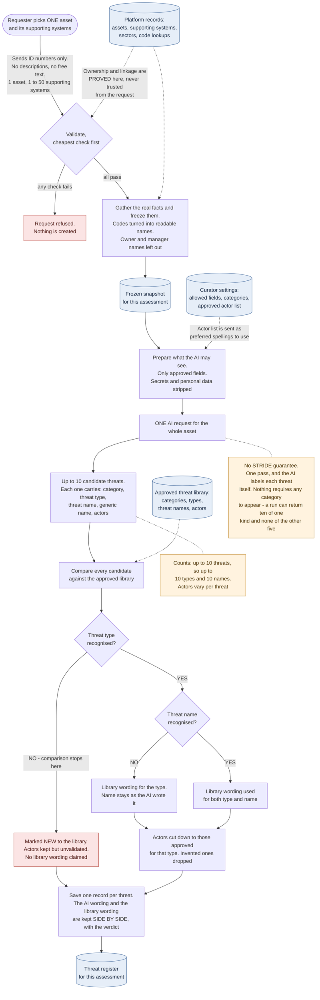
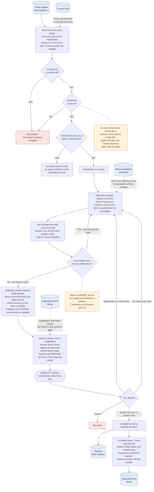
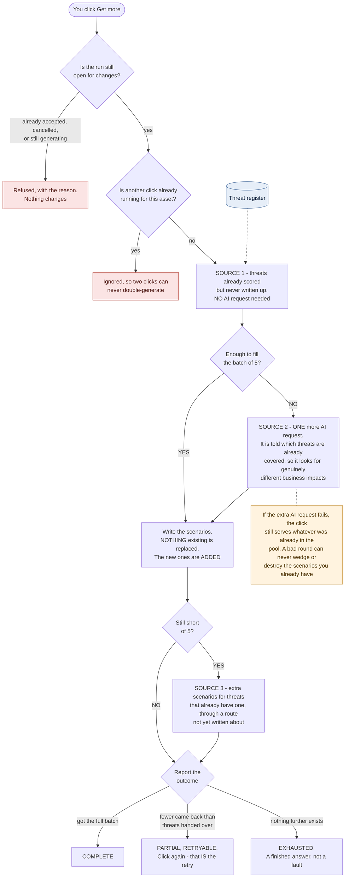
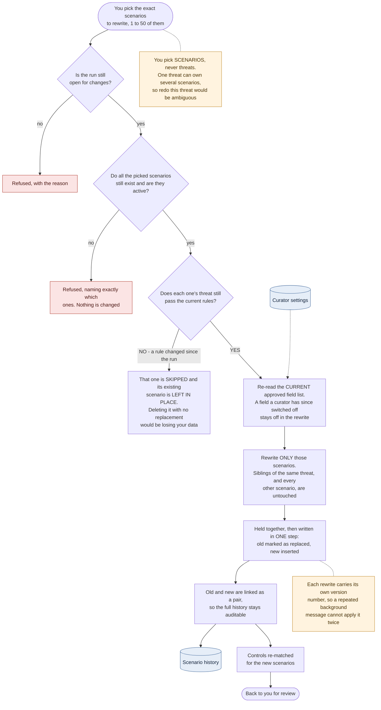

# TSG — End-to-End Data Flow

**For senior management.** Two diagrams. Diagram 1 covers how an asset becomes a checked list of
threats. Diagram 2 covers how those threats become accepted scenarios with controls.

**To edit:** these are Mermaid diagrams — plain text. Change a label by changing the words inside the
quotes. They render automatically in GitHub, VS Code (Markdown preview), Confluence and Teams.

**Legend**

| Shape | Meaning |
|---|---|
| Rounded box | A person acts |
| Rectangle | The system does work |
| Diamond | A decision point |
| Cylinder | Stored data |
| Dotted line | Data being read or written |
| Amber box | Something worth knowing — a rule or a limit |

---

## Diagram 1 — From an asset to a checked list of threats

### Why each comparison works the way it does

| Step | Rationale in one line |
|---|---|
| Category matched exactly | It only narrows the search, so a near-match would buy nothing. |
| Threat type matched by meaning | The same threat worded two ways must land on one library entry. |
| **Stop if the type fails** | The type is the key that unlocks both the names worth comparing against and the approved actor list. Without it, the system refuses to guess. |
| Name searched inside that type only | Stops an unrelated type's wording winning on similar text alone. |
| The **generic** wording is compared | The library is written generically. Comparing asset-named text would mostly measure "does this mention the asset". |
| Actors matched exactly | A curator owns this vocabulary, so the only fair question is "is this exactly one of ours". |
| Overall verdict = the weaker of the two | Confidence is only as good as the weakest check that ran. |
| Nothing claimed on a failed name | The system always has a "closest" candidate, even a poor one. Having a candidate is not evidence of a match. |

> **"NEW to the library" does not mean rejected.** It means nobody has catalogued this threat yet. It
> still gets a full scenario and still reaches a reviewer. These are how the library grows.

---

## Diagram 2 — From threats to accepted scenarios

### How duplicates are handled

Three different outcomes, depending on what is duplicated.

| What is duplicated | Outcome | Why |
|---|---|---|
| The **same threat** proposed twice in one run | **Blocked.** Never recorded. | It is the same finding; a second copy adds nothing. |
| A **route** already written about for that threat | **Blocked.** No further scenario. | The work is already done; this is what makes a run finish. |
| Two threats matching the **same library entry** | **Set aside**, kept for audit, and **its place is freed**. | They are one threat. Freeing the place means you still get a full set of distinct findings. |
| A **scenario** that reads like another one | **Flagged only. The scenario is kept.** | A machine may warn a reviewer. It may not delete a reviewer's work item. |

### What "get more" tells you

| Answer | Meaning | What to do |
|---|---|---|
| **Complete** | Full batch delivered. | Carry on. |
| **Partial, retryable** | Short because something **failed**. | Click again. That is the retry. |
| **Exhausted** | Short because **nothing further exists** — every threat has been written about through every credible route. | Nothing to fix. This is a finished answer. |

---

## Diagram 3 — "Get more" (the next-set flow)

Adds scenarios. Nothing existing is ever replaced.

| Design point | Rationale in one line |
|---|---|
| Cheapest source first | Threats already scored need no AI request at all, so paying for one before that pool is empty would be waste. |
| Only **one** extra AI request per click | Bounds the cost of a click to something predictable. |
| Nothing is replaced | "Get more" means more. Superseding prior work would make the button destructive. |
| Three outcome words, not a count | "Short because something failed" and "short because nothing is left" need opposite responses from you. |
| An extra-request failure is survivable | The click falls back to serving the existing pool rather than failing the whole run. |

---

## Diagram 4 — "Regenerate" (rewriting chosen scenarios)

Replaces only what you pick. Everything else is untouched.

| Design point | Rationale in one line |
|---|---|
| You target scenarios, not threats | A threat can own several scenarios, so "redo this threat" has no single answer. |
| A no-longer-qualifying target is left alone | Destroying a scenario with nothing to put in its place would be data loss, so the old one stays. |
| Current field settings are used, not the original ones | If a curator has since switched a field off, a rewrite must respect that — this is deliberately the opposite of a first run, which freezes its settings. |
| Old and new written in one step | You never see a gap where neither version exists. |
| History kept, not overwritten | The previous version stays readable, so a reviewer can see what changed and why. |

---

## The five things worth remembering

1. **Only ID numbers are accepted.** The system looks up every fact itself, so no description can be
   pushed in from outside.
2. **One unlinked supporting system refuses the whole request** rather than quietly assessing a
   partial picture.
3. **The AI never sees the library before proposing.** It proposes freely and everything is checked
   afterwards, so the library's current contents cannot cap what gets discovered.
4. **Automatic checks warn; they never discard.** Every borderline case goes to a person.
5. **Nothing enters the shared library without a human acceptance first**, and new threat actors are
   never created automatically.

---

*Every figure and rule here was taken from the source code on branch
`tsg-without-profile-decomposition`, not from earlier documentation. If the pipeline changes, update
this file with it.*
