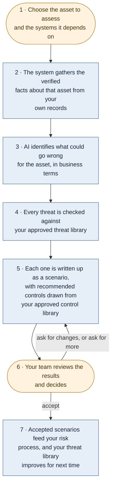

# Threat Scenario Generator — How It Works

**One page for senior management.**

TSG takes one asset you need to protect, works out what could realistically go wrong, writes each
risk up in plain business language with recommended controls, and then stops and waits for your team
to decide. **Only what a person accepts becomes a result.**

---

## The workflow

**Amber = your team acts · Blue = happens automatically**

Steps 2 to 5 run unattended in the background. Nobody waits at a screen.

---

## What each step gives you

| Step | What comes out of it |
|---|---|
| **1 · Choose** | One asset per assessment, so every result is attributable to something specific. |
| **2 · Gather** | The system reads your own records. Nothing is taken on trust from a screen or a request. |
| **3 · Identify** | A short list of credible business impacts — not technical vulnerabilities. |
| **4 · Check** | Each threat is either matched to your approved library, or marked as new to it. Both go forward. |
| **5 · Write up** | A readable scenario per threat: how it happens, what it costs the business, what would reduce it. |
| **6 · Decide** | Accept all, accept some, ask for rewrites, ask for more, or cancel. |
| **7 · Accept** | Results become available to your risk process, and genuinely new threats improve the library. |

---

## The five questions management usually asks

**Is it defensible in an audit?**
Yes. The prioritisation is fixed arithmetic, not AI judgement — the same asset with the same records
always produces the same ranking. Every AI request and every reply is recorded word for word,
including failed ones, so any scenario can be traced back to exactly what was asked and answered.

**Can the AI quietly change our threat library?**
No. Nothing enters the shared library without a person accepting it first. New threat wording goes to
a curator unless it is clearly novel, and new threat actors are **never** created automatically —
only linked to ones you already approved.

**Is our sensitive information exposed to the AI?**
Only fields an administrator has explicitly approved are sent. Secrets and personal data are stripped
first, and the names of the people who own or manage a system are never sent at all. If the approved
list is empty, nothing is sent — it errs toward sending too little.

**Who is actually in control?**
Your team. There is exactly one decision point, and it comes after the work is done, so reviewers
spend their time on finished material rather than approving intermediate steps. A result waiting for a
reviewer is never timed out or cleaned up.

**What if something fails part way through?**
Whatever was completed still reaches your team, with the shortfall flagged. Work already produced is
never discarded because a later item failed. Automated quality checks **warn** a reviewer; they never
delete a reviewer's work item.

---

## Two things that set expectations

**The number of scenarios varies by asset, and that is deliberate.** Each threat earns one scenario
per credible route it could travel to reach the asset. An asset with two supporting systems produces
noticeably fewer scenarios than one with eight. Volume follows real exposure rather than a fixed
quota, so a large result is not a fault.

**"New to the library" is a finding, not a failure.** It means nobody has catalogued that threat yet.
It still gets a full scenario and full review, and it is how the library grows. These are often the
most valuable results in an assessment.

---

## Where to go for more detail

| Audience | Document |
|---|---|
| Business, risk and audit | [THREAT_WORKFLOW_BUSINESS.md](THREAT_WORKFLOW_BUSINESS.md) |
| Functional teams running assessments | [THREAT_SCENARIO_FLOW_FUNCTIONAL.md](THREAT_SCENARIO_FLOW_FUNCTIONAL.md) |
| Process and data flow, step by step | [TSG_DATA_FLOW_DIAGRAMS.md](TSG_DATA_FLOW_DIAGRAMS.md) |
| Engineering | [HOW_THREATS_ARE_GENERATED.md](HOW_THREATS_ARE_GENERATED.md) |
